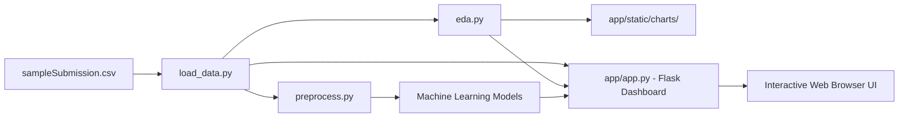

# AdSpark - Click-Through Rate (CTR) Prediction System

**AdSpark** is an end-to-end ML solution and interactive web dashboard built with **Flask** for predicting digital advertisement Click-Through Rates (CTR) based on the famous **Avazu 11-Day Ad Impression Dataset**.

---

## 📌 Project Overview & Problem Statement

In online advertising (sponsored search, display ads, and real-time bidding platforms), **Click-Through Rate (CTR)** is the most critical metric evaluating ad performance and publisher revenue. 

### Competition Background (Avazu Contest)
The Avazu competition provides **11 days worth of real-world mobile ad impression data** to build and test prediction models. 

- **Goal:** Predict the probability that a user will click on a mobile advertisement given impression context (user device, app, site, banner position, timestamp, etc.).
- **Primary Metric:** **Logarithmic Loss (Log Loss)** — penalizes confident incorrect predictions.
- **Target Variable:** `click` (Binary: `0` = No Click, `1` = Click).
- **Core Challenge:** High-cardinality categorical variables (`site_id`, `app_id`, `device_id`, `device_ip`, `device_model`, `C14-C21`), feature sparsity, and temporal dynamics across 11 consecutive days.

---

## 📁 Directory & File Structure

```text
AdSpark/
├── app/                        # Flask Web Application
│   ├── app.py                  # Main Flask routes and application entry point
│   ├── static/
│   │   ├── css/
│   │   │   └── style.css       # Clean, modern UI styling (Inter font, responsive flex layout)
│   │   └── charts/             # Auto-generated EDA visualizations (PNG charts)
│   └── templates/              # Jinja2 HTML templates
│       ├── base.html           # Master layout with navigation bar and sticky header
│       ├── home.html           # Project welcome & introduction
│       ├── dataset.html        # Dataset summary statistics & live sample table
│       ├── eda.html            # Interactive Exploratory Data Analysis charts
│       ├── preprocessing.html  # Data pipeline & transformation explanation
│       ├── models.html         # Overview of ML classification algorithms
│       ├── evaluation.html     # Performance metrics (Log Loss, AUC-ROC)
│       ├── comparison.html     # Model comparison dashboard
│       └── strategy.html       # Advanced competition strategy & methodology
├── data/                       # Dataset storage
│   └── sampleSubmission.csv    # Kaggle submission benchmark file
├── models/                     # Saved trained model artifacts (.pkl / .joblib)
├── results/                    # Exported evaluation metrics & submission files
├── src/                        # Core Machine Learning source modules
│   ├── __init__.py
│   └── data/
│       ├── __init__.py
│       ├── load_data.py        # Dataset loading & summary calculation functions
│       ├── preprocess.py      # Feature engineering, split, and standardization
│       └── eda.py             # Matplotlib/Seaborn visualization pipeline
├── main.py                     # Project root execution script
├── requirements.txt            # Python dependencies (Flask, pandas, scikit-learn, etc.)
└── README.md                   # Complete project documentation
```

---

## ⚙️ How the Project Works (Architecture & Pipeline)



### 1. Data Loader (`src/data/load_data.py`)
- Reads dataset from `data/sampleSubmission.csv` (or `data/train.csv` if available) into pandas DataFrames efficiently.
- Computes baseline metrics: total record count, feature count, target column name, and overall Click-Through Rate (CTR percentage).

### 3. Preprocessing & Feature Engineering (`src/data/preprocess.py`)
- Performs **stratified train-test splitting (80/20)** based on the target variable (`click`).
- Identifies and categorizes numerical features vs. categorical features.
- Applies **StandardScaler** normalization to continuous/numerical columns.
- Safely drops non-predictive identifiers (`id`).

### 4. Visual Exploratory Data Analysis (`src/data/eda.py`)
Automatically generates high-resolution charts and saves them directly to `app/static/charts/`:
- `click_distribution.png`: Target class balance (Click vs. No Click).
- `device_type_distribution.png`: Breakdown of ad traffic across Mobile Phones, Tablets, and other devices.
- `banner_pos_click.png`: Click-Through Rate variance across ad banner positions.
- `correlation_heatmap.png`: Correlation matrix across numerical and categorical features.

### 5. Flask Web Application (`app/app.py`)
A lightweight, modern web server providing interactive pages:
- `/` - **Home**: Overview, metric definition, and project targets.
- `/dataset` - **Dataset**: Real-time dataset summary and raw data preview table.
- `/eda` - **EDA**: Rendered charts generated from the analysis pipeline.
- `/preprocessing` - **Preprocessing**: Explains feature scaling, data split, and transformations.
- `/models` - **Models**: Details supervised classification models evaluated on the dataset.
- `/evaluation` - **Evaluation**: Defines Logarithmic Loss, AUC-ROC, and classification metrics.
- `/comparison` - **Comparison**: Comparative benchmark matrix of algorithms.
- `/strategy` - **Strategy & Methodology**: Competition strategy to beat baseline classifiers.

---

## 🎯 Competition Strategy to Beat Standard Algorithms

Standard classifiers (like naive Logistic Regression or Decision Trees) often plateau at a Log Loss of ~0.42. To beat standard baseline algorithms in the Avazu CTR competition, **AdSpark** leverages the following advanced techniques:

1. **High-Cardinality Categorical Encoding:**
   - **Target Encoding (with smoothing):** Replaces high-cardinality IDs (`site_id`, `app_id`, `device_model`) with out-of-fold historical click probabilities.
   - **Frequency Encoding:** Uses occurrence counts to signify rare vs. frequent publisher apps/sites.
   - **Feature Hashing (Hashing Trick):** Maps millions of unique categorical values into fixed-size sparse matrices.
2. **Temporal Feature Extraction:**
   - Decomposes the 11-day timestamp into `hour_of_day`, `day_of_week`, and peak traffic indicators.
3. **Advanced Modeling Architectures:**
   - **Gradient Boosted Decision Trees (LightGBM / CatBoost):** Handles categorical splits natively with leaf-wise tree growth.
   - **Field-aware Factorization Machines (FFM):** Captures pairwise feature interactions across different feature fields (essential for CTR data).
   - **Deep & Cross Networks (DCN / DeepFM):** Combines explicit cross-features with deep neural network embeddings.

---

## 🚀 Installation & Running Guide

### Prerequisites
- **Python 3.8+**
- **pip** package installer

### 1. Setup Virtual Environment & Install Dependencies
```bash
# Navigate to the project root directory
cd e:/PythonProject/AdSpark

# Activate virtual environment (if available)
# Windows PowerShell:
.\.venv\Scripts\Activate.ps1

# Install requirements
pip install -r requirements.txt
```

### 2. Run EDA Pipeline
Generate the latest visualizations for the web dashboard:
```bash
python src/data/eda.py
```

### 4. Run the Flask Web Dashboard
```bash
python app/app.py
```
Open your browser and navigate to: **`http://127.0.0.1:5000`**

---

## 📊 Summary of Tech Stack
- **Backend Framework:** Python, Flask, Jinja2
- **Data Science & ML:** pandas, NumPy, scikit-learn, Matplotlib, Seaborn
- **Frontend / UI:** HTML5, Modern Vanilla CSS (Inter Typography, CSS Variables, Glassmorphism elements)
- **Evaluation Metric:** Logarithmic Loss (Log Loss)

---

## 📜 License
This project is open-sourced under the MIT License for educational and research purposes in ad click prediction and sponsored search modeling.
